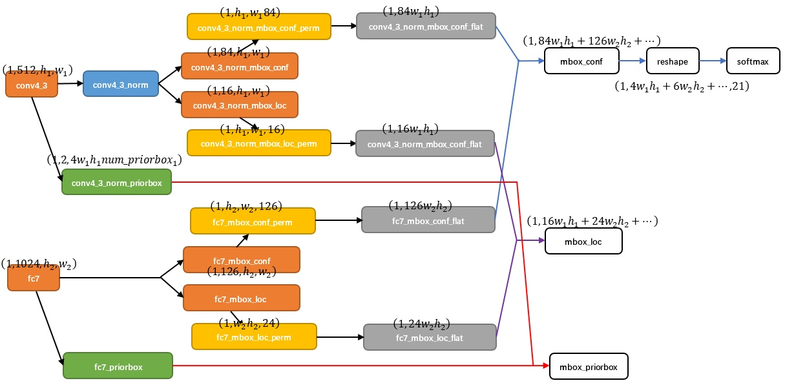

# SSD 模型

论文：SSD: Single Shot MultiBox Detector

## 模型

SSD模型的一个核心之处在于：预测一系列相对于Default Bounding Box的Category Scores和Box Offsets。而不是通过一个RPN的结果生成ROI然后计算Bounding Box。

在SSD中用到的Prior Box与Anchor的区别在于：前者是在多个Feature Map Level上生成Anchor Boxes。

### 网络结构提取Features Maps

下图是SSD与YOLOv1网络结构之间的对比：

SSD中以VGG16为base network，输入的大小为$300 * 300$。从*conv5_3layer*(降维8倍)开始，每个Stage都会进行目标检测。从上图可以看出，SSD中共选择了6个Stage，通过最后几个Stage来提高对全局信息的利用，而前几个Stage利用丰富的空间信息。

#### 基于Feature Maps生成Prior Box

SSD中在多个Feature Map Level中生成Anchor Box，具体过程如下：在Freature Map的每个像素位置(与Channel无关)生成*k*个Anchors，然后每个Anchor都会预测分类、Anchor的Offset等。因此，对于一个分辨率为$hw$的Feature Map，共生成$k*w*h$个Anchors；因为要对每个Anchor预测$c$个分类结果以及4个offset参数($\Delta (cx, cy, w, h)$)，因此对应一个Stage的Feature Map输出的尺寸为$w*h*k*(c+4)$，其中$w*h$是空间分辨率，c是类别数(包含背景)；$k*(c+4)$对应的是Channel的数量，因此在上面的示意图中也可以看出，一个用于输出这些数据的Convolution Filter的尺寸为$Conv: 3*3*(4*(classes + 4))$。其中，第一个4就是$k$。

在实际中，对不同Stage的输出，设置不同的Aspect和Scale。Scale的计算公式如下：

$$s_k = s_{min} + \frac{s_{max} - s_{min}}{m - 1}(k-1), k\in[1, m]$$

其中，m是在SSD中生成候选框的Feature Map的层数，比如默认是6层的Feature Map来生成Prior Box。其中，第一层的候选框的最小值和最大值分别为：$s_1, s_2$。

Aspect的计算公式如下：

$$w_k^a = s_k * \sqrt{a_r}$$

$$h_k^a = s_k / \sqrt{a_r}$$

其中， $a_r$的取值范围为：[1, 2, 3, 1/2, 1/3]。

另一个更详细的一张图：

从上图可以看出，在conv4_3(与最开始的示意图有点区别)层Feature Map的Prior Box生成后包含了3条线路：

1. 经过一次batch norm+一次卷积后，生成了[1, num_class*num_priorbox, layer_height, layer_width]大小的feature用于softmax分类目标和非目标（其中num_class是目标类别，SSD300中num_class = 21，即20个类别+1个背景)

2. 经过一次batch norm+一次卷积后，生成了[1, 4*num_priorbox, layer_height, layer_width]大小的feature用于bounding box regression（即每个点一组[dxmin，dymin，dxmax，dymax])。值得注意的是，这里预测的也是偏移量，这一点可以从文章中loc的损失函数的计算上看出来。

3. 生成了[1, 2, 4\*num_priorbox\*layer_height*layer_width]大小的prior box blob，其中2个channel分别存储prior box的4个点坐标(x1, y1, x2, y2)和对应的4个参数variance

简单补充一下，这个variance对应的是对网络预测的偏移量的系数，貌似是叫权重。详情可以见上面的参考链接或者论文。

#### 最后输出检测结果

这一步又在上一步的基础上得到所有Stage的所有Anchors的分类结果以及Offset用于计算损失。上面对Prior Box的生成以及使用做了简单的说明，这里就是后续由Prior Box得到检测结果的更具体的说明了。

关键的一张图：

在图中可以看出，Conv4_3、fc7等Feature Map Layer生成Prior Boxes，然后每层的Priro Boxes被送入三路，SSD把这么多分支通过Permute、Flatten、Concat这三种层整合到一起。

下面根据数据流说一下由Prior Boxes得到检测结果的流程。

1. 首先Prior Boxes经过conv4_3_norm(batch normal + conv)处理之后，产生conv4_3_norm_mbox_conf和conv4_3_norm_mbox_loc。分别对应Prior Boxes的分类信息和偏移量。可以看出来，后两者的大小分别对应了[1, 84, $h_1, w_1$]和[1, 16, $h_2, w_2$]。前面说过，每个像素默认产生4个Prior Boxes，然后包含背景在内共21个类别，所以这里的84就是对应每个像素位置的Prior Boxes(4个)产生21个类别的预测分数(用于Softmax输入)。后面的16对应的是每个Prior Boxes预测4个偏移量。这个第一步对应的是Permute操作，也就是Transpose，把channel维放置在最后一维，便于后续处理。

2. 第二步，在上一步中把channel维度放置在最后一维后，然后进行flatten，这样是方便后面把不停Level的结果进行Concat起来。channel维放置在最后一层并进行flatten之后，就相当于变成二维矩阵，维度是[1， $84h_1w_1$]。每一行中，连续21个数值对应一个prior Box的21个类别分数，共4个Box，然后行数为1。

3. 第三步，是把不同层产生的flatten后的数据Concat起来。因为fc7中每个像素产生6个Prior Boxes，所以图中现实的数字是$(1, 84w_1h_1, 126w_2h_2 + ...)$。在把不同层的Prior Boxes以这种方式拼接起来后，在进行一次Reshape, 得到数据的shape为[1, $4w_1h_1+6w_2h_2 + ...$, 21]，最后就可以送入到Softmax对每一个Prior Box进行分类了，一般深度学习框架中的Softmax默认是在输入数据的最后一维上进行计算。

至于剩下的另外两路，原理是相同的。

#### SSD为什么比YOLO快

可以清楚的看到，YOLOv1里面涉及到了全连接层。全连接层计算完成后，在reshape回$7*7*30$的3维结构。全连接层的单元数也就是1470。YOLO的输入的尺寸也比SSD的大。

## 训练

在开始涉及目标函数之前，首先看一下输出的检测结果的具体含义是啥。

### 分类损失

输出的检测结果包含两个部分，一个用于分类，一个用于Anchors回归。前者关注的比较多，就是对Softmax输出结果计算交叉熵，交叉熵是基于KL散度定义的，而KL散度是基于信息熵定义的，最后信息熵则是基于自信息定义的。

(这部分对应的是：[1, $4w_1h_1 + 6w_2h_2 + ...$, 21]数据)

直接来说，交叉熵定义如下：

$$CE(P, Q) = -E_{x \sim P}(\log Q(x))$$

其中，P、Q分别是数据分布、神经网络的预测分布(模型分布)。这里用数据分布代替我们想要得到的真实分布，因此数据越多越接近真实分布，训练效果也就越好。

针对Softmax的分类结果，本文用到的交叉熵损失函数如下：

$$L_{conf}(x, c) = - \sum_{i \in Pos}^N x_{ij}^p \log(\hat{c}_i^p) - \sum_{i \in Neg} \log(\hat{c}_i^0) $$

其中，x表示真实类别，$\hat{c}$表示预测的类别(Softmax的输出)，$\hat{c}_0$表示背景类，表示把Negative Anchor预测为背景的损失(不明白为啥)。

### Offset损失

这部分对应的是：[1， $1, 16w_1h_1+ ...$]数据块

对于Bounding Box的Offset的预测，这里与之前的RCNN、Fast RCNN以及Faster RCNN的处理是一致的。预测的都是Bounding Box相对于Anchor的位移 + 长宽变化(YOLO中是直接预测BBox的位置+长宽变化)。

首先看下这部分对应的损失函数：

$$L_{loc}(x, l, g) = \sum_{i \in Pos}^N \sum_{m \in \{cx, cy, w, h\}} s_{ij}^ksmooth_{L1}(l_i^m - \hat{g}_j^m)$$

其中，训练的目标数据为$\hat{g}$，计算如下(注意这里是Loc分支的预测**目标**。)：

$$\hat{g}_j^{cx} = (g_j^{cx}-d_i^{cx} / d_i^{w})$$

$$\hat{g}_j^{cy} = (g_j^{cy}-d_i^{cy} / d_i^{h})$$

$$\hat{g}_j^{w}=\log \left( \frac{g_j^w}{d_i^w} \right)$$

$$\hat{g}_j^{h} = \log \left( \frac{g_j^h}{d_i^h} \right)$$

其中，$g$为Box的GroundTruth，包含[x, y, w, h]即中心位置+长宽, $d$为Anchor的参数(也是中心位置 + 长宽)，$l$为网络的预测结果(对应的Offset)，并且预测的h和w都是对数域的值。那么根据这个预测的Offset由Anchor得到Bounding Box(BBox就是Anchor修改后的预测框)呢？公式如下：

$$dx' = dx + lx * dw$$

$$dy' = dy + ly * dh$$

$$dw' = dw\exp(lw)$$

$$dh' = dh\exp(lh)$$

### Matching Strategry

对于每一个GroundTruth框，在所有的Anchor中选择Jaccard Overlap大于阈值0.5的作为Positive，而不是只选取最高的那个Anchors。

### Hard Negative Mining

经过上面的Matching后，大多数的Anchor都是Negative的。所以需要经过Hard Negative Mining，具体做法就是，选取那些导致较大分类损失的Anchor用于训练，最后Neg:Pos的比例大约在3:1。这可以实现更快的收敛速度。

### 性能指标

* mAP

  其实这个指标可以从后到前分成三步进行分析。

  * P

    就是**一幅图像**上的**一个类别**的分类精度。

  * AP

    就是**所有图像**上的**一个类别**的分类精度的均值。

  * mAP

    就是**所有图像**上的**所有类别**的分类精度的均值。

## 一些值得注意的地方

* 超出边缘的Anchor的处理。

  采用Faster RCNN中的方式，直接忽略在Boundary上面的Box。会导致性能较大的降低。还有一点是，把不同Scale的Boxes分配到不同的Feature Layer是十分重要的，但并不说明本文计算Scale的公式是好的，这一点可以在后面的PAnet里面看出来，有一些比较大的Scale放在更高层、一些小的Scale放在更底层会进一步提高精度。

* 大约80%的时间都花在了底层VGG网络上了。

* SSD的一些缺点以及可能的改进

  * 相对于Faster RCNN，对小目标检测结果较差

    可能的原因在于，Faster RCNN 在网络的顶部其实是有一个Resampling步骤的，也就是两次的Box Refinement Steps，分别对应着RPN中一次、后面的Fast RCNN中一次！

  * 针对这个问题，可能的改进

    Design a better tiling of default boxes so that its position and scale are better aligned with the receptive field of each position on a feature map.貌似就是Mask RCNN中提到的Align问题。

## 其它相关工作的分析

RCNN的速度以及精度有待提高，由于需要重复对各个候选框提取特征，因此计算量很大，后面的框架也就围绕这两个方面进行改进。主要分为一下几类：

### First Set: 提高post-classification的质量以及速度

后面SPPNet提出了ROI Pooling的前身，也就是对输入图像只计算一次Feature Map，然后在Feature Map上对不同的候选框进行分类。后面的Fast RCNN更进一步，简化了SPPNet中的Spatial Pyramid Pooling操作，就是去掉了Pyramid的操作，也就是ROI Pooling，并且可以支持End-to-end的训练，同时训练分类以及BBox回归。

### Second Set： 提高候选框的生成质量

典型代表就是Faster RCNN中用深度学习模块(RPN)来提高候选框的生成质量。与本位的联系与区别：

Our SSD is very similar to the region proposal network (RPN) in Faster R-CNN in that we also use a fixed set of (default) boxes for prediction, similar to the anchor boxes in the RPN. But instead of using these to pool features and evaluate another classifier, we simultaneously produce a score for each object category in each box.

也就是One-Stage的思路了。

### Third Set: One Stage算法

 典型的就是YOLO系列了。

后面结合MXNet的代码写一下。

完。

##  

